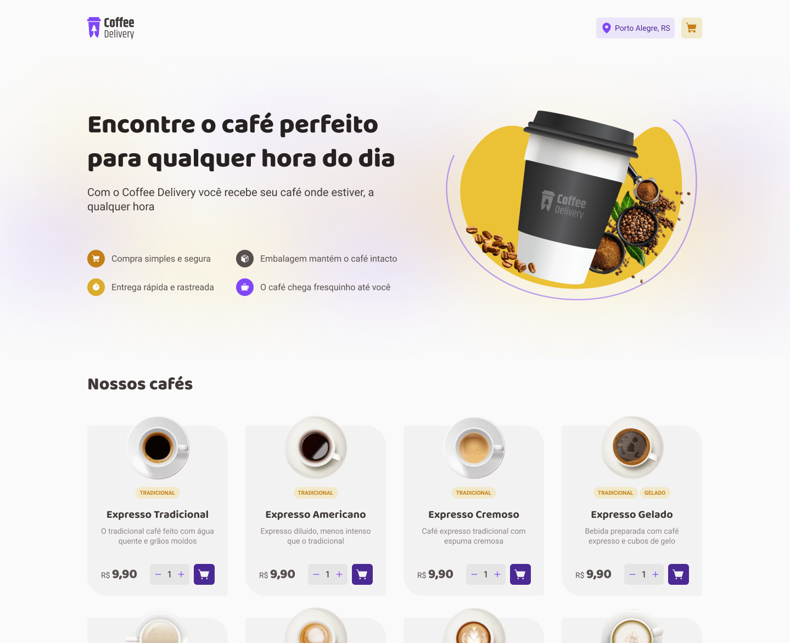

# Coffe Delivery - Buy your delicious coffee ☕

<br><br>

<p align="center">
  <a href="#-about-the-project">About the project</a> •
  <a href="#-technologies">Technologies</a> •
  <a href="#-getting-started">Getting started</a> •
  <a href="#-license">License</a>
</p>

<p align="center">
 
 
 
</p>

## 👩‍💻 About the project

Site for buying coffees, where you go through the phase of adding the product to the cart, choosing the address and confirming the order!

Project built during [Rocketseat](https://rocketseat.com.br/) ReactJS course, where I was able to deepen my knowledge of this front-end library

[click here, see closer](https://coffee-delivery-cs.vercel.app/) 😉

## 🔖 Layout

You can view the project layout through the links below:

- [Layout in Figma](<https://www.figma.com/file/5aI3PhpxXL68RRIUThGngS/Coffee-Delivery-(Copy)>)

> Remembering that you need to have a [Figma](http://figma.com/) account to access it.

## 🚀 Technologies

- [ReactJs](https://reactjs.org/)
- [Styled Components](https://styled-components.com/)
- [useForm](https://react-hook-form.com/api/useform/)
- [zod](https://zod.dev/)
- [React Router](https://reactrouter.com/en/main)

## 💻 Getting started

### Requirements

- [Node.js](https://nodejs.org/en/)
- [Yarn](https://classic.yarnpkg.com/) or [NPM](https://www.npmjs.com/) _(examples are with yarn)_

**Clone the project and access the folder**

```bash
$ git clone https://github.com/leandrorodrigues00/coffee-delivery && cd offee-delivery

```

**Follow the steps below**

```bash
# Install the dependencies
$ yarn

# Make a copy of '.env.example' to '.env'
# and set with YOUR environment variables.
$ cp .env.example .env

# Start the app
$ yarn dev
```

## 📝 License

This project is licensed under the MIT License - see the [LICENSE](LICENSE) file for details.

---

<p align="center">
  Made with 💜&nbsp; by  Leandro Rodrigues
</p>
